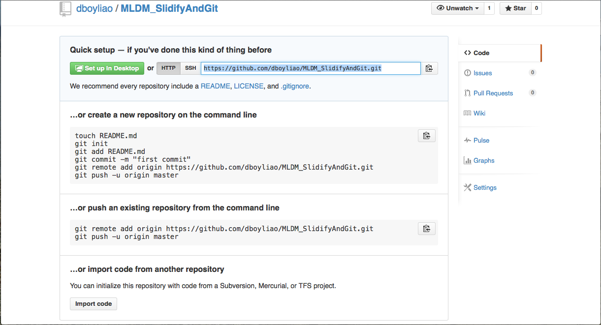

Slidify, git and github

- slidify is a R package which can make customized slides easily using R Markdown.

  
  

---

Slidify, git and github

- publish(): publish your slides to github or dropbox
- You have to enable ssh access before you use publish().
- [Here](https://help.github.com/articles/generating-ssh-keys) is the document.

---

Slidify, git and github

- publish(): publish your slides to github or dropbox
- You have to enable ssh access before you use publish().
- [Here](https://help.github.com/articles/generating-ssh-keys) is the document.

You should be able to see this slide over here: 

   

[http://dboyliao.github.io/MLDM_SlidifyAndGit/](http://dboyliao.github.io/MLDM_SlidifyAndGit/)

---

Slidify, git and github

- publish(): publish your slides to github or dropbox
- You have to enable ssh access before you use publish().
- [Here](https://help.github.com/articles/generating-ssh-keys) is the document.

You should be able to see this slide over here: 

[http://dboyliao.github.io/MLDM_SlidifyAndGit/](http://dboyliao.github.io/MLDM_SlidifyAndGit/)

* Empty page?

---

Slidify, git and github

- publish(): publish your slides to github or dropbox
- You have to enable ssh access before you use publish().
- [Here](https://help.github.com/articles/generating-ssh-keys) is the document.

You should be able to see this slide over here: 

[http://dboyliao.github.io/MLDM_SlidifyAndGit/](http://dboyliao.github.io/MLDM_SlidifyAndGit/)

* Empty page?
* Take it easy. I did not upload my slides yet.

---

Slidify, git and github

- publish(): publish your slides to github or dropbox
- You have to enable ssh access before you use publish().
- [Here](https://help.github.com/articles/generating-ssh-keys) is the document.

You should be able to see this slide over here: 

[http://dboyliao.github.io/MLDM_SlidifyAndGit/](http://dboyliao.github.io/MLDM_SlidifyAndGit/)

* Empty page?
* Take it easy. I did not upload my slides yet.
* From now on, I will teach you how to complete this slides and upload it to github using either git or publish() step by step.

---

Slidify, git and github

- publish(): publish your slides to github or dropbox
- You have to enable ssh access before you use publish().
- [Here](https://help.github.com/articles/generating-ssh-keys) is the document.

You should be able to see this slide over here: 

[http://dboyliao.github.io/MLDM_SlidifyAndGit/](http://dboyliao.github.io/MLDM_SlidifyAndGit/)

* Empty page?
* Take it easy. I did not upload my slides yet.
* From now on, I will teach you how to complete this slides and upload it to github using either git or publish() step by step.
* This talk is designed for those who are not familier with git and github. If you are expert of these tools, here are three options for you.

---

Slidify, git and github

- publish(): publish your slides to github or dropbox
- You have to enable ssh access before you use publish().
- [Here](https://help.github.com/articles/generating-ssh-keys) is the document.

You should be able to see this slide over here: 

[http://dboyliao.github.io/MLDM_SlidifyAndGit/](http://dboyliao.github.io/MLDM_SlidifyAndGit/)

* Empty page?
* Take it easy. I did not upload my slides yet.
* From now on, I will teach you how to complete this slides and upload it to github using either git or publish() step by step.
* This talk is designed for those who are not familier with git and github. If you are expert of these tools, here are three options for you.
  - Take my place.

---

Slidify, git and github

- publish(): publish your slides to github or dropbox
- You have to enable ssh access before you use publish().
- [Here](https://help.github.com/articles/generating-ssh-keys) is the document.

You should be able to see this slide over here: 

[http://dboyliao.github.io/MLDM_SlidifyAndGit/](http://dboyliao.github.io/MLDM_SlidifyAndGit/)

* Empty page?
* Take it easy. I did not upload my slides yet.
* From now on, I will teach you how to complete this slides and upload it to github using either git or publish() step by step.
* This talk is designed for those who are not familier with git and github. If you are expert of these tools, here are three options for you.
  - Take my place.
  - Be my TA.

---

Slidify, git and github

- publish(): publish your slides to github or dropbox
- You have to enable ssh access before you use publish().
- [Here](https://help.github.com/articles/generating-ssh-keys) is the document.

You should be able to see this slide over here: 

[http://dboyliao.github.io/MLDM_SlidifyAndGit/](http://dboyliao.github.io/MLDM_SlidifyAndGit/)

* Empty page?
* Take it easy. I did not upload my slides yet.
* From now on, I will teach you how to complete this slides and upload it to github using either git or publish() step by step.
* This talk is designed for those who are not familier with git and github. If you are expert of these tools, here are three options for you.
  - Take my place.
  - Be my TA.
  - Go home, take a shower and go to bed. (可以洗洗睡了)

--- 

Slidify, git and github

- Once you are done, your github repo will look like this:

---

<!---

Slidify, git and github

- git is a tool for version control.

  
  

-->

---

<!---

Slidify git and github

- github is a service platform where you can upload your work on the web!

  
  

-->

---

<!---
# git

- Have no idea what git does for you? Picture this!

-->

---

<!---
# That is All!

`Thanks for your attention.`
-->
